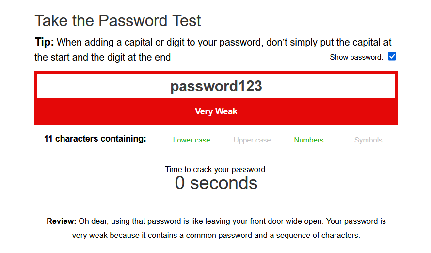
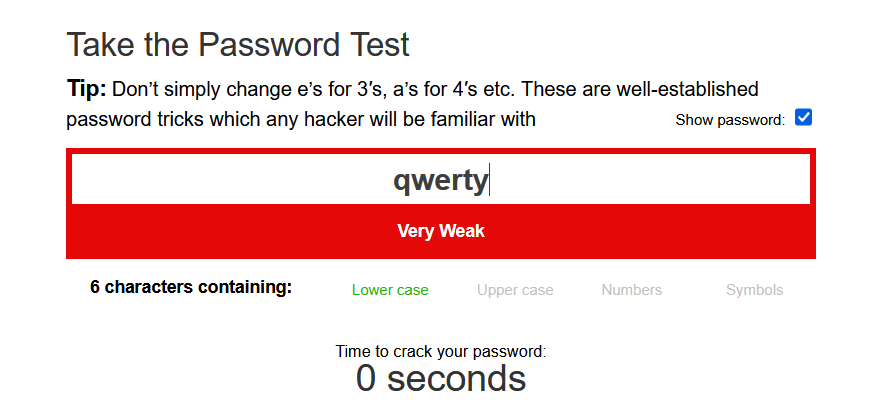
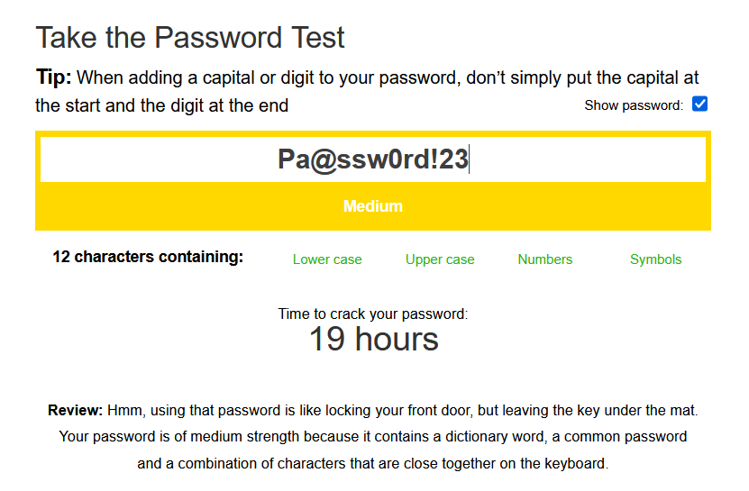
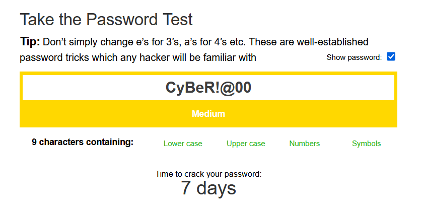
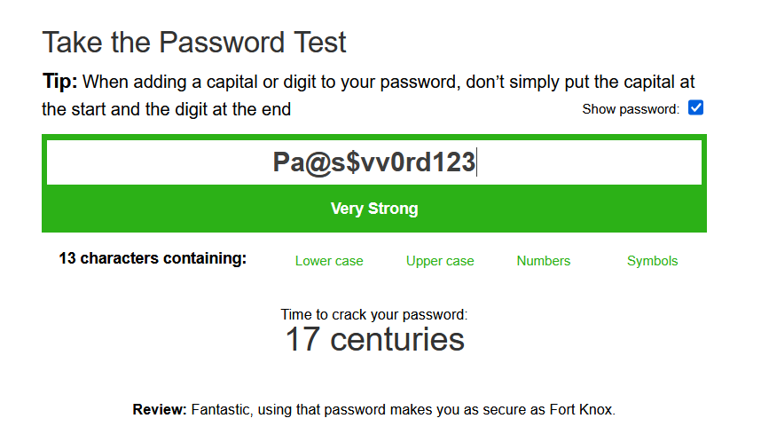
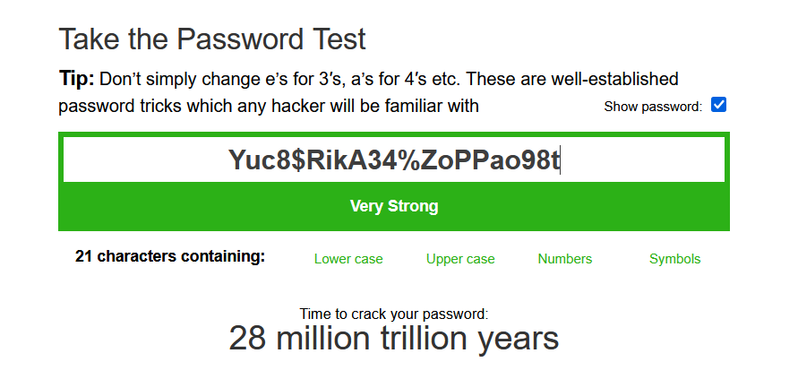

# Password Strength Report

### Passwords Tested
1. `password123` → Weak 
2. `qwerty` → Weak
3. `CyBeR!@00` → Medium
4. `Pa@ssw0rd!23` → Medium
5. `Pa@s$vv0rd123` → Strong 
6. `Yuc8$RikA34%ZoPPao98t` → Strong

### Observations
- Simple lowercase words are easily broken.
- Adding uppercase, symbols, and numbers improves security.
- Longer passphrases are much harder to crack.

### Tips Learned
- Use at least 12–16 characters.
- Combine letters, numbers, and symbols.
- Avoid personal info (DOB, name, etc.).
- Use passphrases for better memorability.
